# produtividade-mcps_sqlsaturday-sp-2026
Slides e conteúdos da apresentação "Produtividade no uso de Bancos de Dados com IAs: descomplicando tarefas do dia a dia com MCP Servers". Palestra realizada no dia 28/03/2026, durante a edição 2026 do SQL Saturday em São Paulo-SP.

## MCP Servers úteis ao se trabalhar com Bancos de Dados

| Descrição | Comando / URL de Ativação | Link |
|-----------|---------------------------|------|
| MCP Oficial do Microsoft Learn | `https://learn.microsoft.com/api/mcp` | https://github.com/microsoftdocs/mcp |
| MCP de geração de dados fake | `docker run -i --rm renatogroffe/dotnet10-consoleapp-mcp-fakedata` | https://github.com/renatogroffe/dotnet10-consoleapp-mcp-fakedata |
| MCP Oficial do draw.io | https://mcp.draw.io/mcp | https://github.com/jgraph/drawio-mcp |
| MCP Oficial do Excalidraw | https://mcp.excalidraw.com | https://github.com/excalidraw/excalidraw-mcp |
| Extensão Oficial do Postgres (inclui MCP Server) | - | https://marketplace.visualstudio.com/items?itemName=ms-ossdata.vscode-pgsql |
| Extensão Oficial do SQL Server (inclui MCP Server) | - | https://marketplace.visualstudio.com/items?itemName=ms-mssql.mssql |
| Extensão Oficial do Mermaid (inclui MCP Server) | - | https://marketplace.visualstudio.com/items?itemName=MermaidChart.vscode-mermaid-chart |

---

## Informações sobre o evento

Título da apresentação: **Produtividade no uso de Bancos de Dados com IAs - descomplicando tarefas do dia a dia com MCP Servers**

Evento: **SQLSATURDAY São Paulo 2026**

Data: **28/03/2026 (sábado)**

Tecnologias e tópicos abordados: **MCP, GitHub Copilot, Visual Studio Code, Inteligência Artificial, LLMs, Containers, Docker, Docker Hub, Docker MCP Catalog, Windows, Linux, macOS, .NET, ASP.NET Core, NuGet, Node.js, npm, pip, Python, Claude, SQL Server, PostgreSQL, Mermaid, draw.io, Excalidraw...**

Número de participantes: **90 pessoas (estimativa)**

Site do evento: **https://sqlsaturday.com.br/**

Link do evento (inscrições): [**Sympla**](https://www.sympla.com.br/evento/sqlsaturday-sao-paulo-2026/3244336)

Local: **Centro Universitário Eniac - Rua Força Pública, 89 - Centro - Guarulhos - CEP: 07012-030**

Acesse este [**link**](/img/) para visualizar todas as fotos da apresentação.

Esta palestra foi realizada em conjunto com meu amigo **Milton Camara (Microsoft MVP)**.

Deixo aqui meus agradecimentos ao **Marcelo Adade (Microsoft MVP)**, **André Di Battista (volutário no evento)** e demais organizadores por todo o apoio para que participássemos como palestrantes desta edição do **SQLSaturday**.

---

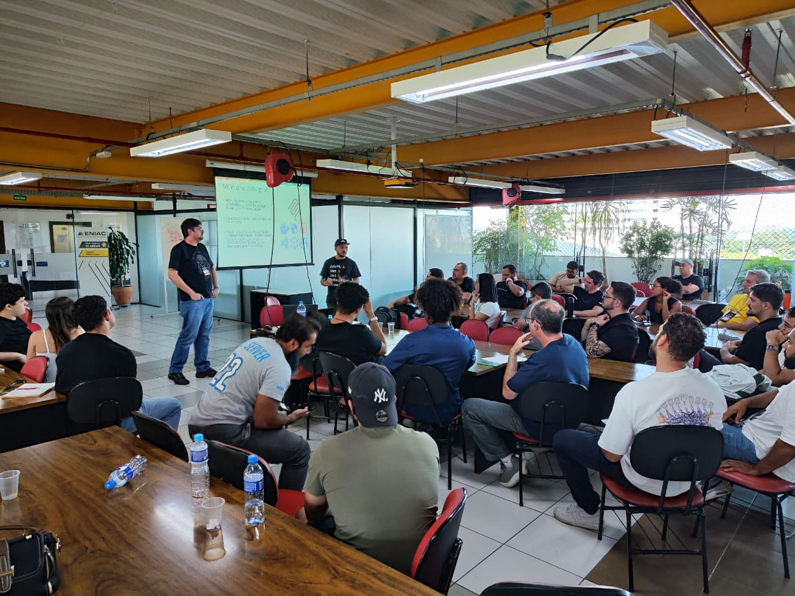

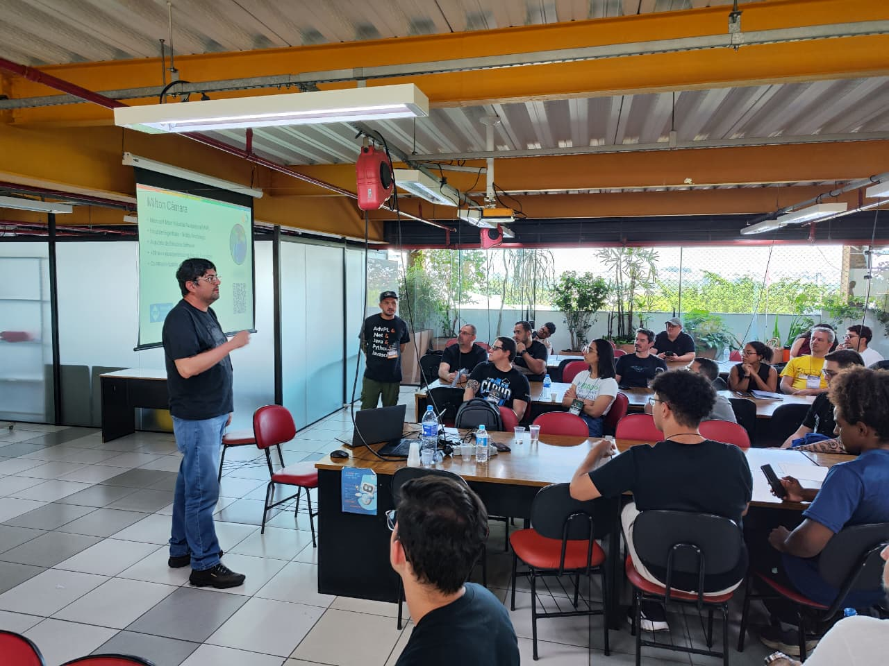

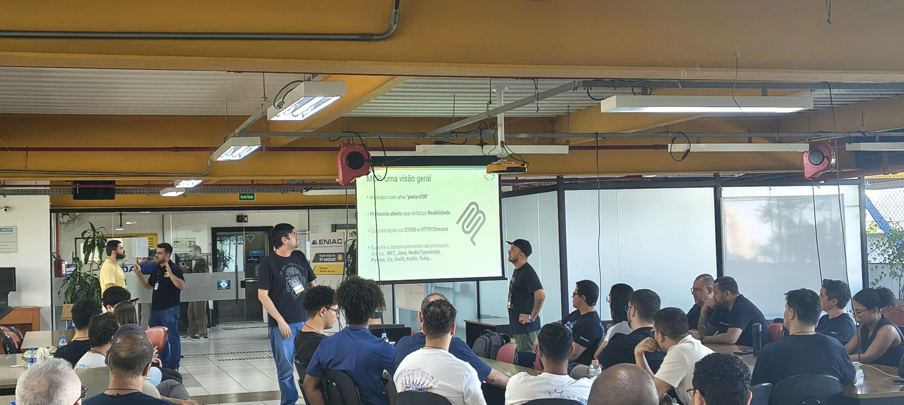

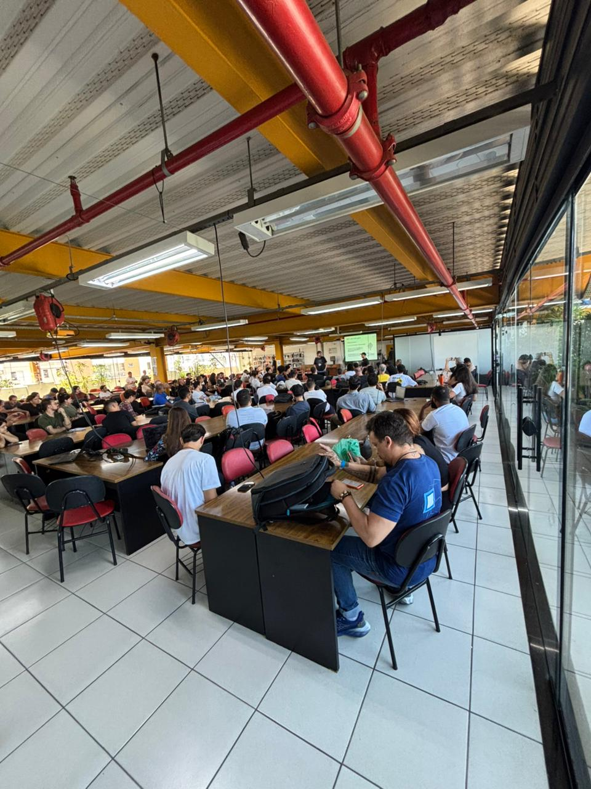

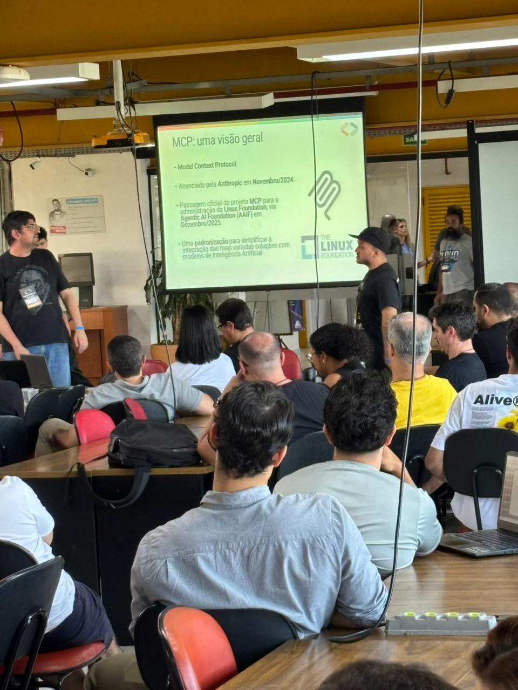

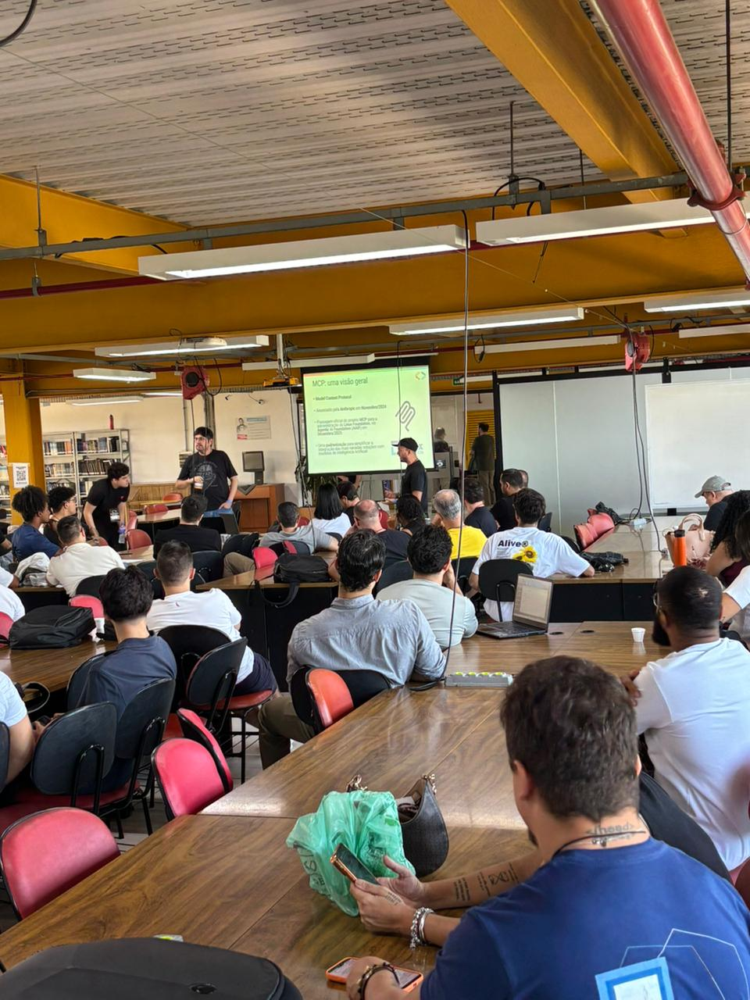

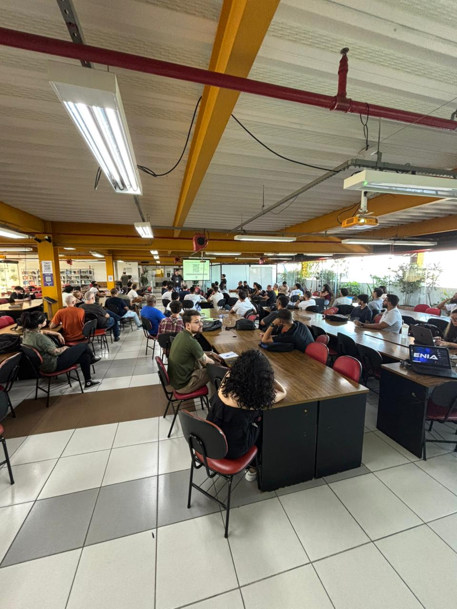

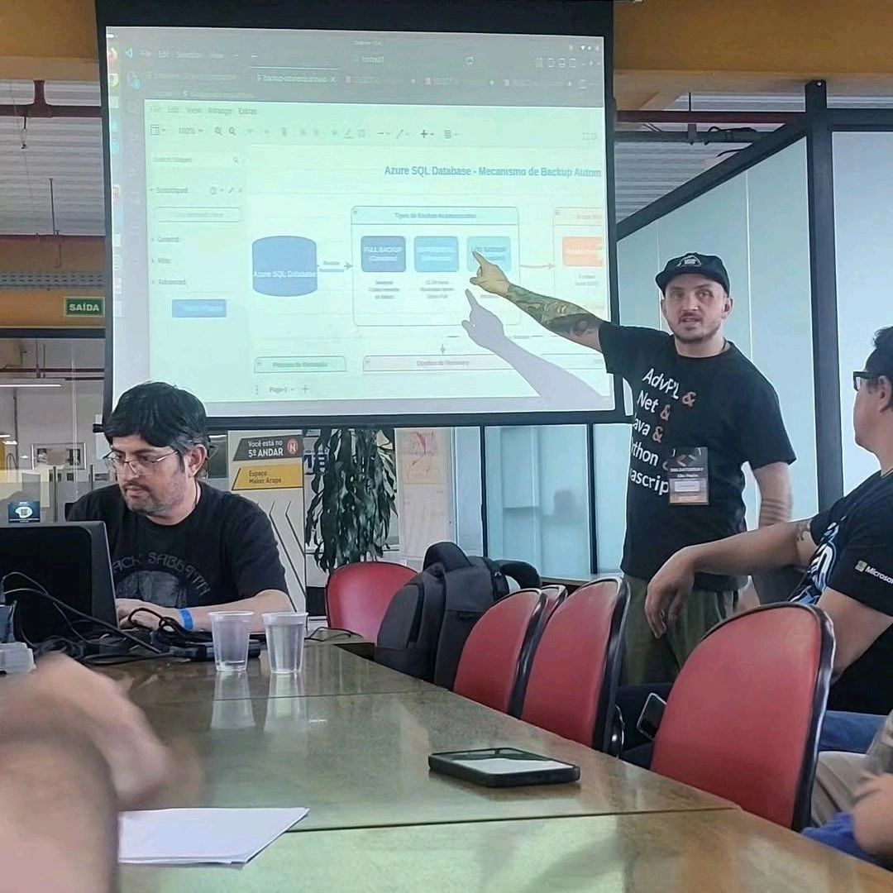

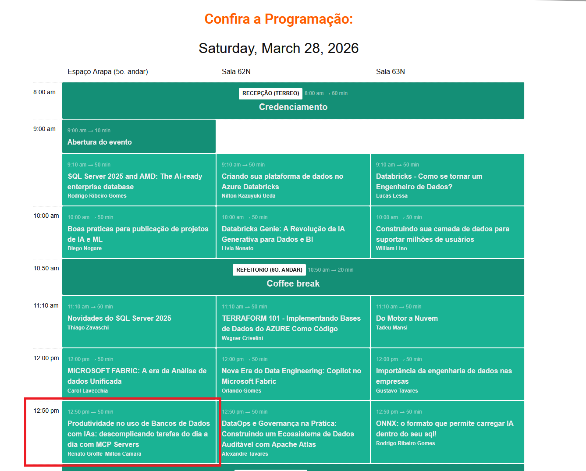

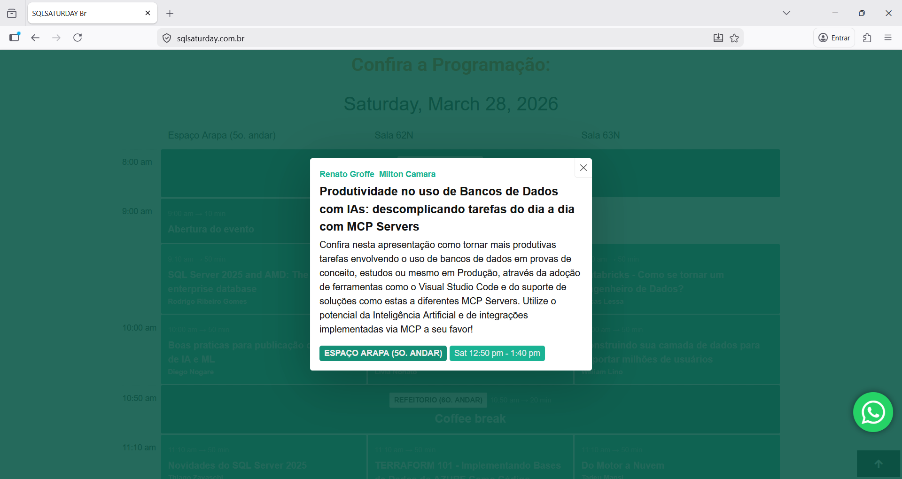

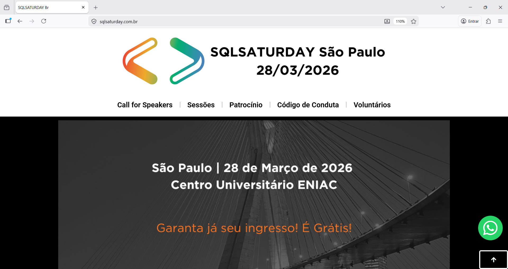